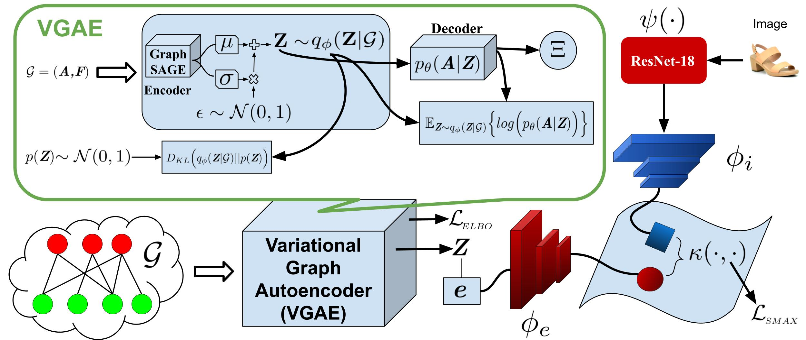

# CVGAE
Official Code for blind submission for the paper titled "On Leveraging Variational Graph Embeddings for Open World Compositional Zero-Shot Learning" 


# On Leveraging Variational Graph Embeddings for Open World Compositional Zero-Shot Learning

This is the code accompanying the paper: On Leveraging Variational Graph Embeddings for Open World Compositional Zero-Shot Learning. The code provides the implementation of the model CVGAE and functions for training and evaluation.

<p align="center">
  
</p>

## Setup

1. Clone the repo

2. Install python of version 3.9

3. Use pip to install required libraries.

   ```
   pip install -r requirements.txt
   ```

## Data

The data can be downloaded from publicly available github repositories from the authors of CGE and CompCos. https://github.com/ExplainableML/czsl

Since following the instructions and extracting features can be cumbersome for learned reviewers, we have also uploaded the data on anonymized AWS S3 Bucket. This is to ensure that results can be produced with relatively less effort. We ask the reviewers to download the data from here: https://cvgae.s3.eu-west-1.amazonaws.com/data.tar.gz

The data in the anonymized AWS S3 Bucket contains raw images as well as the extracted image and initial graph embeddings used by CGE and CompCos. 
We have tried to ensure that once this data is downloaded the results can be reporduced by simply running the commands below. 

## Training

**CZSL.** To train a model, the command is simply:

```
python train_script.py --name model_cvgae_ut --ds ut --lr 5e-5 --bs 64 --close_world 

python train_script.py --name model_cvgae_ut_open_world --ds ut --lr 5e-5 --bs 64

python train_script.py --name model_cvgae_mit --ds mit --train_only --bs 64 --close_world 

python train_script.py --name model_cvgae_mit_open_world --ds mit --lr 5e-5 --bs 64 

python train_script.py --name model_cvgae_cgqa --ds cgqa --train_only --bs 64 --close_world --cpu_eval

python train_script.py --name model_cvgae_cgqa_open_world --ds cgqa --bs 64 --cpu_eval --eval_every 5


```

Please refer to `flags.py` for all parameters.

**Image Retrieval.** For the image retrieval task, add the `--ir_model` flag:

```
python train_script.py --name model_name --ds ut --ir_model --eval_every 5
```

## Test

To test a trained model, simply specify the model name and use the `--eval` flag:

```
python train_script.py --name trained_model_name --eval
```

and for image retrieval model:

```
python train_script.py --name trained_model_name --ds mit --ir_model --eval
```

## Derivation of ELBO

<p align="center">
  
</p>


